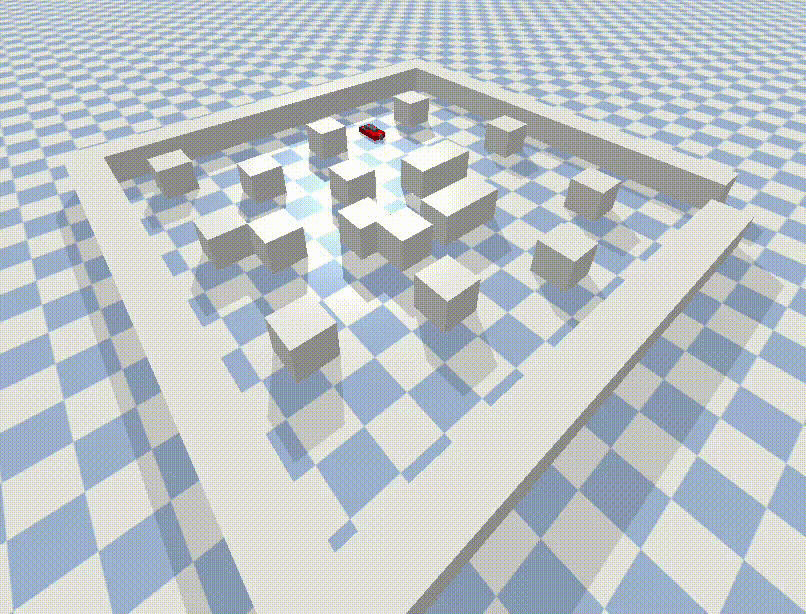

# PDM-group-33

# Car Simulation with Planner Integration

This project simulates a simplified car robot in a virtual environment. It combines a custom **URDF model** of the car with a **path-planning algorithm** that enables the robot to navigate through obstacles to reach a target building.



---

## Overview
The project demonstrates the integration of:
- A **simplified car URDF model**, showcasing the vehicle's key features such as wheels and a chassis.
- A **custom planner** that allows the car to:
  1. Navigate through an environment with static obstacles.
  2. Reach a designated target (e.g., a building).
  3. Adapt to various environments based on the vehicle's kinematic constraints

This simulation is ideal for testing robotic control systems and planners in a rescue scenario.

---

## Features
- **Simplified car URDF Model**:
  - Includes basic geometry for wheels and a chassis.
  - Configurable for different scenarios and dimensions.
  
- **Path Planning**:
  - Uses RRT* to find the optimal path from start to finish avoiding while static obstacles.
  - Utilizes the MPC method to optimize and follow the path, respecting the kinematic constraints of the car.

---

### Installation
1. Install the simulation environment by following the instructions on :

    ``` {.sourceCode .bash}
    https://github.com/maxspahn/gym_envs_urdf
    ```

2. Clone the repository:
   ```bash
   git clone git@github.com:mugiwaranolstar/PDM-group-33.git
   ```

3. Go to the scripts' directory:
   ```bash
   cd PDM-group-33/scripts
   ```

4. Run the full code:
   ```bash
   python3 launch_code.py
   ```

This runs the three scripts:
**G33_rrt_star.py**, **mpc_constraints.py** and **simulation.py** in a row.
If desired, the three scripts can be run separately:

1. To run the global planner:
   ```bash
   python3 G33_rrt_star.py
   ```
This command runs the RRT* algirthm to find the global path from start to goal. It then saves all the obstacles in a file named 'obstacles.csv' and the found path in a file named 'G33_rrt_star.csv' in the 'csv_files' directory, overwriting any existing files of the same name.

2. To run the local planner:
   ```bash
   python3 mpc_constraints.py
   ```
This runs the MPC algorithm to follow the global path and creates a file of the found local path named 'MPC_path.csv' in the 'csv_files' directory, again, overwriting any files of the same name. Note that the MPC local planner can either be run on the RRT or RRT* generated path. This can be done by (un)commenting the corresponding input line specified at the top of the code. Similar for the adjusted obstacle environment to validate the obstacle avoidance of the MPC.

3. To simulate the movement of the robot in the environment:
   ```bash
   python3 simulation.py
   ```
Finally, with this command the MPC algorithm's path is simulated in the pybullet environment while respecting collision and kinematic constraints.

   - **Note that the three scripts need to be run in the aforementioned order for them to work together.**

The 'Results_csv' directory contains the csv files of the paths discussed in the report.

